# 📋 Etapas

##### _Este é um projeto acadêmico, não um tutorial._

## 🔀 Switch Virtual

### 1. Antes de seguir com a criação da VM, será necessário criar um Switch Virtual através do _Gerenciador do Hyper-V_, na opção _Gerenciador de Comutador Virtual_

## 2. Como a intenção é ter uma aplicação web acessível a minha rede, selecionarei Switch Externo.

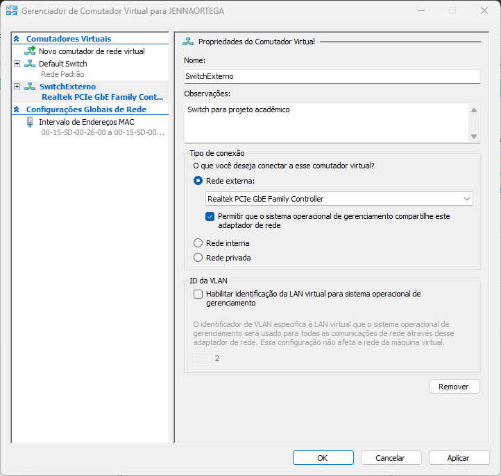

## 2.1 Abaixo, um breve resumo de cada tipo de Switch:

| Tipo      | Como funciona                | 💡 Quando usar                                                                        |
| --------- | ---------------------------- | ------------------------------------------------------------------------------------- |
| 🔌Externo | Host + Rede Local + Internet | VM precisar ser acessada por outras máquinas, e acesso a internet                     |
| 🧱Interno | Host + VM                    | Possibilita testes de domínio AD, DNS etc                                             |
| 🔒Privado | Apenas VMs                   | Também possibilita testes, mas com isolamento maior para testes de FireWall, IDS etc. |

## 🖥️ Virtual Machine Quick Create

### 1. Segui com a criação da minha VM com ubuntu 22.04, visível na interface principal do _HYPER-V Quick Create_.

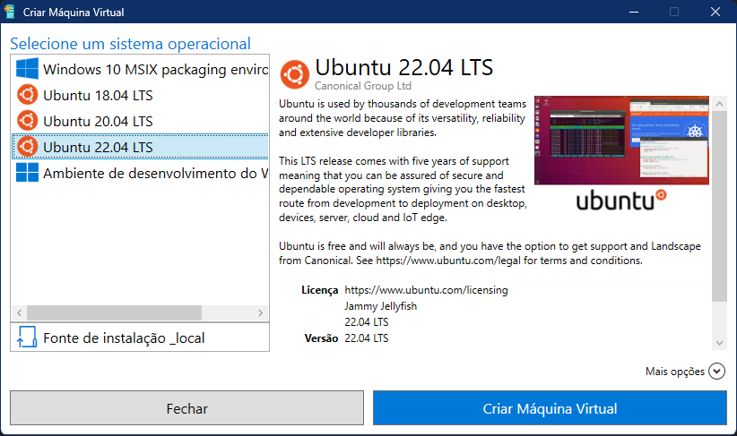

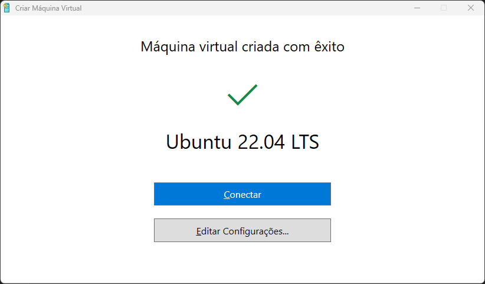

### 2. Nas configs da VM, vinculei ela a meu switch externo.

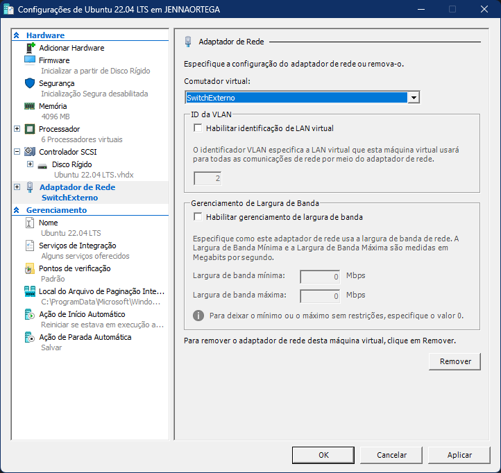

### 3. Após finalizar configuração, já é possível acessa-lá.

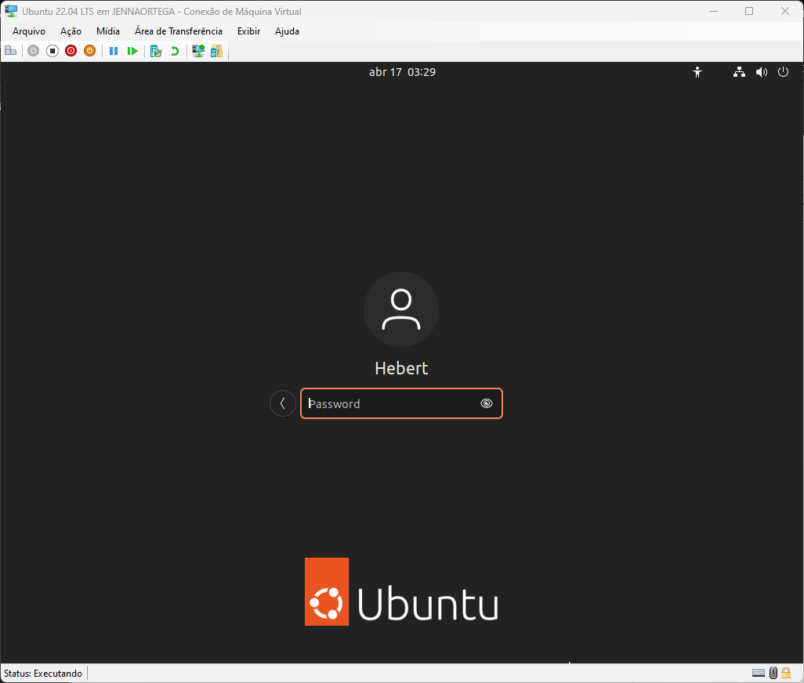

## 🐧 Ubuntu 22.04

### 1. Já dentro da VM, rodei os seguintes comandos no terminal:

#### 🌐 Para coletar o IP da VM. No meu caso, é o 192.168.0.54:

    ip a

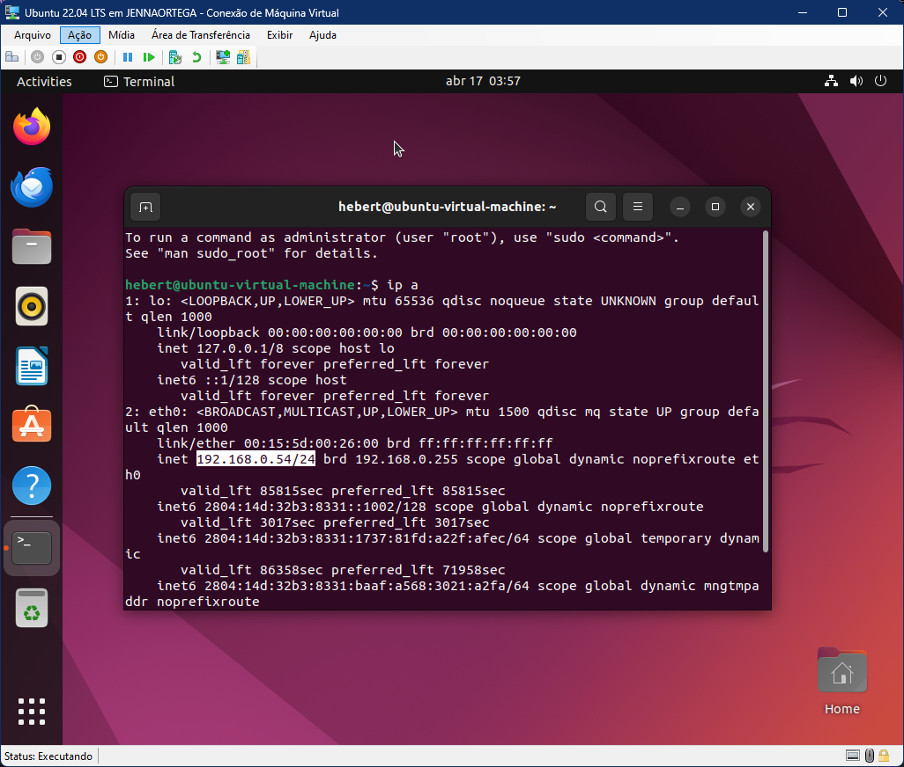

#### 🌀 Para instalar o nginx e verificar o status:

    sudo apt update
    sudo apt install nginx -y
    systemctl status nginx

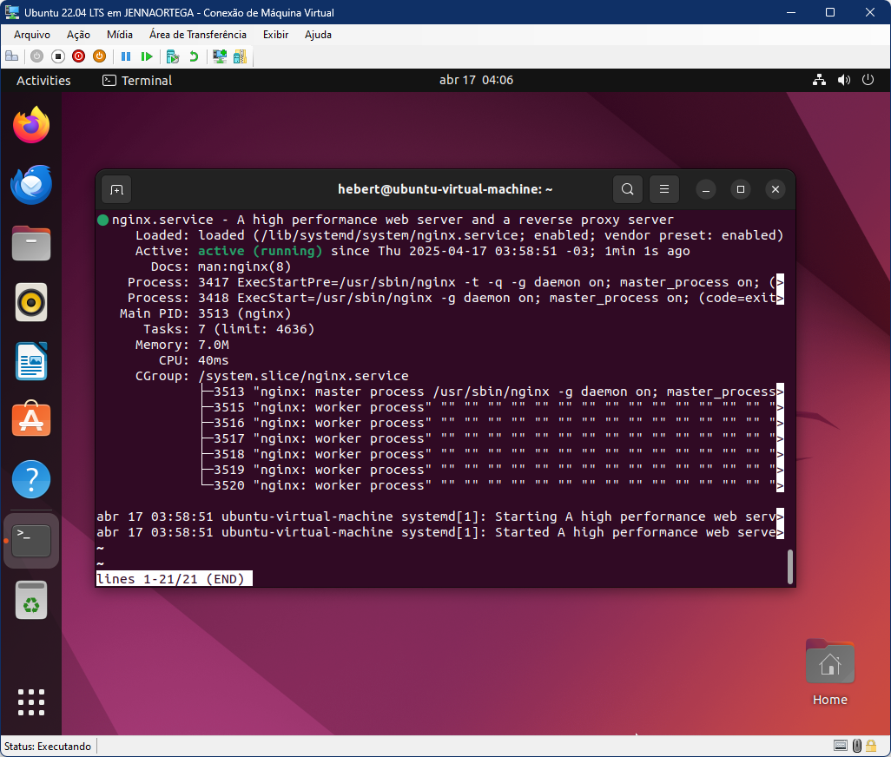

### 2. Ao adicionar o IP da VM no navegador do host, já é possível enxergar o HTML do NGINX:

🔺 _Nenhuma alteração foi feita na porta. Por padrão, a comunicação foi setada para a porta 80 (http)._

## 🌐 Servidor Web

### 1. Primeiro precisei liberar a porta SSH da nossa VM e, para isso, usei os seguintes comandos:

    sudo apt update
    sudo apt install openssh-server -y

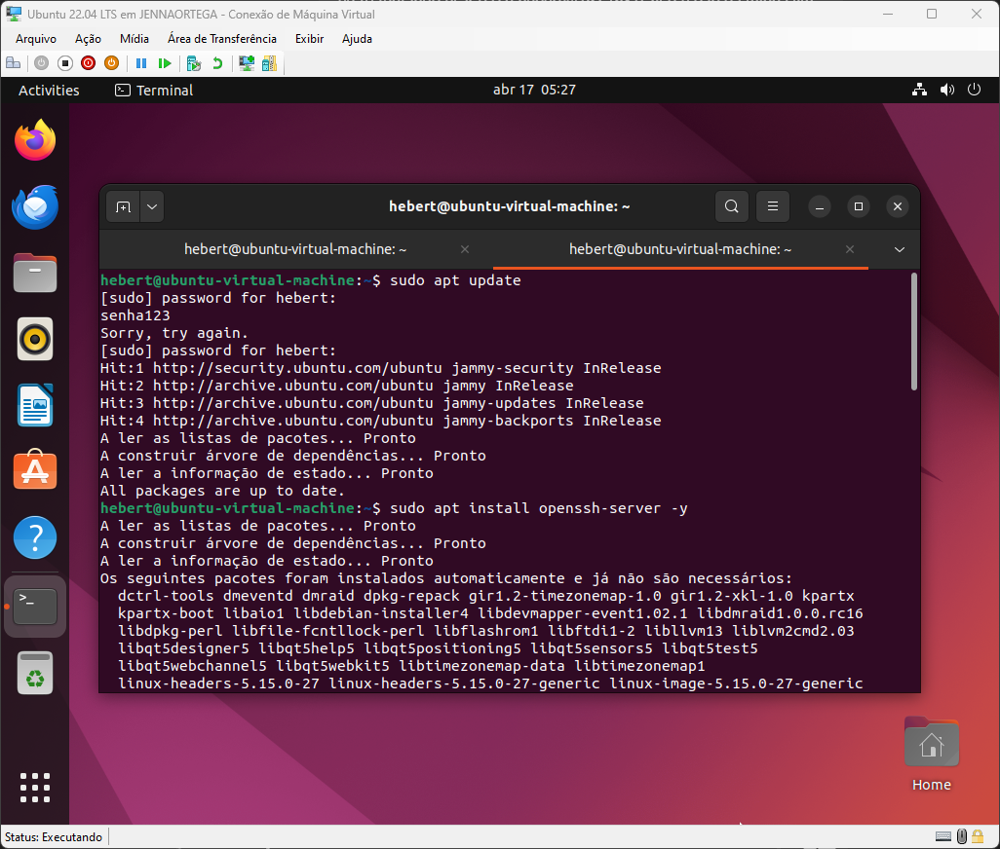

### 1.2. Habilitando SSH:

    sudo systemctl start ssh
    sudo systemctl enable ssh

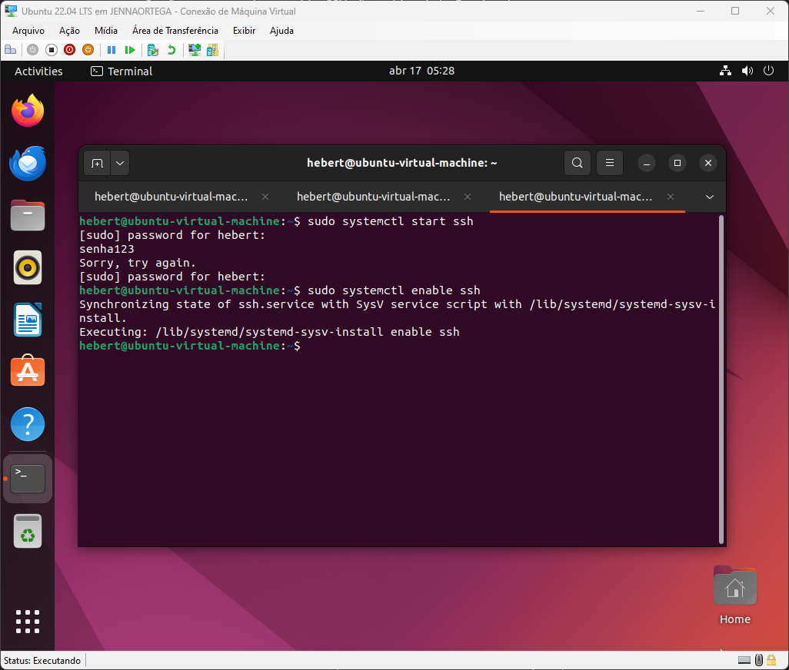

### 1.3. Testando conexão via SSH no host:

    ssh usuario@ip-da-vm
    exit

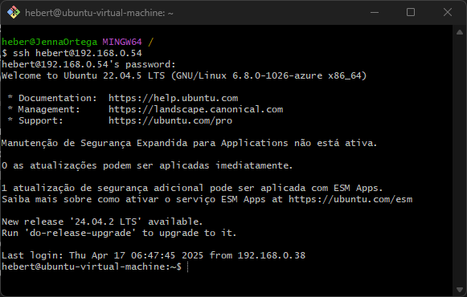

### 2. Tranferindo minha aplicação do host para a VM.

    cd diretorio-da-aplicação-local
    scp -r * usuario@ip-da-vm:/tmp

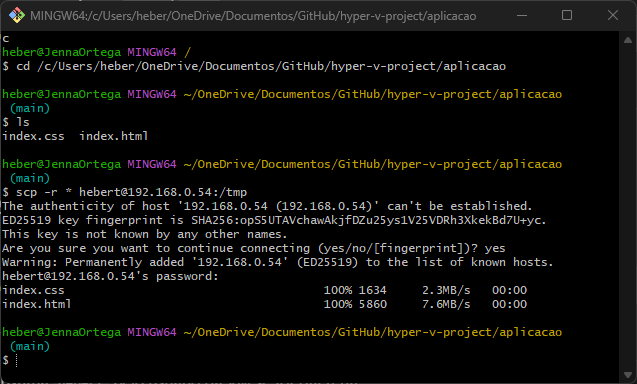
🔺 _No meu caso, será utilizado apenas um HTML e CSS simples para exemplificar o seu funcionamento._

### 2.1. Substituindo html do _Nginx_ pela aplicação recém transferida:

    sudo mv /tmp/* /var/www/html/

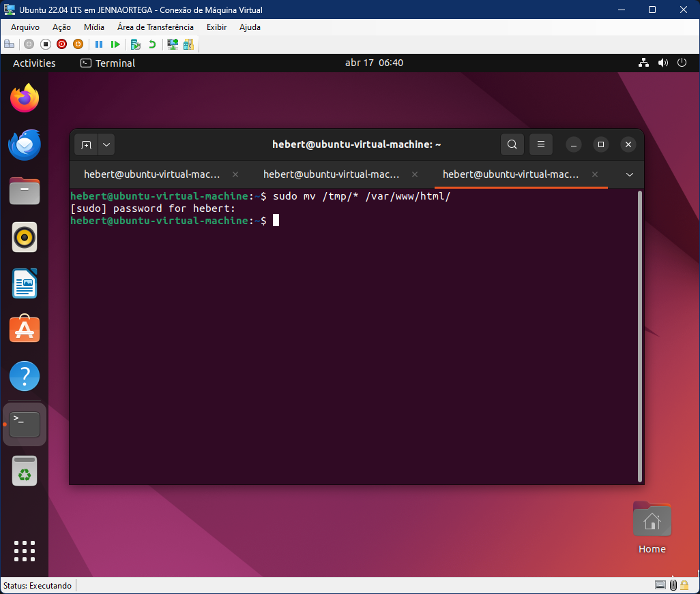

# 🎯 Resultado Final!

### Ao retornar ao navegador, com o IP da VM, já é possível visualizar a aplicação que substituimos.

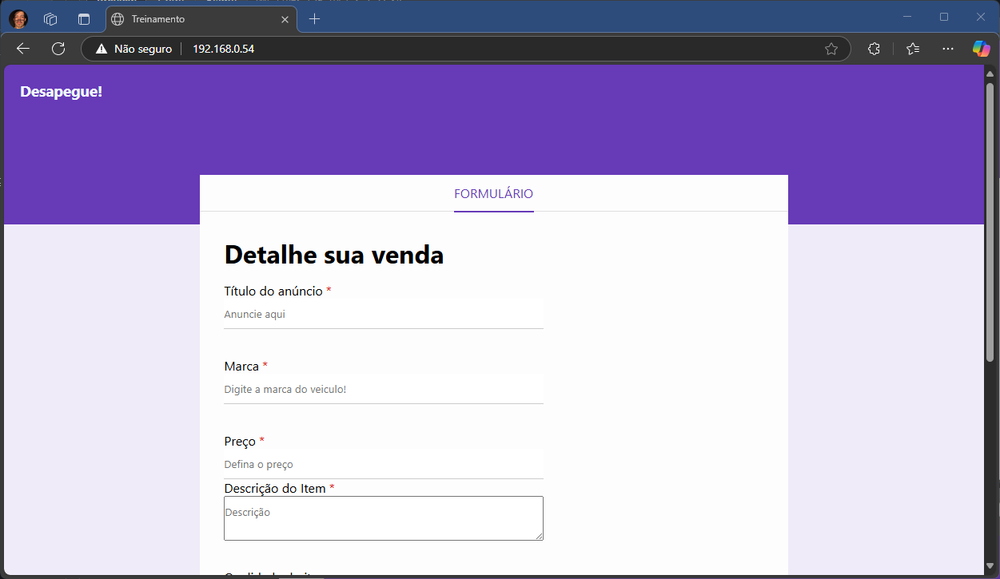

